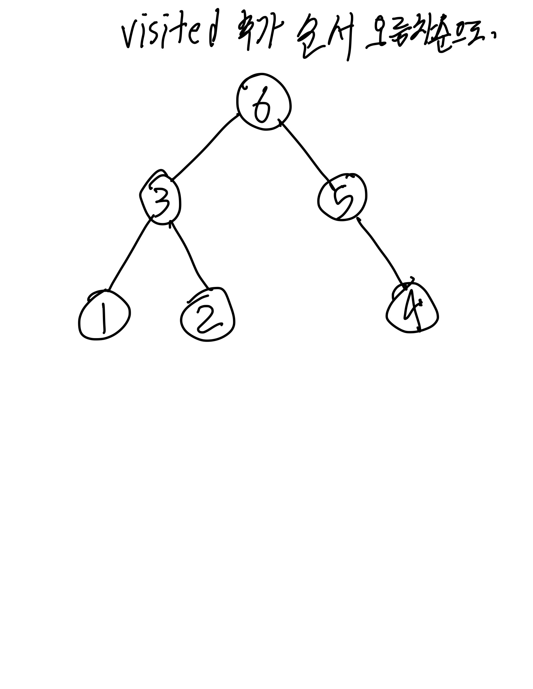
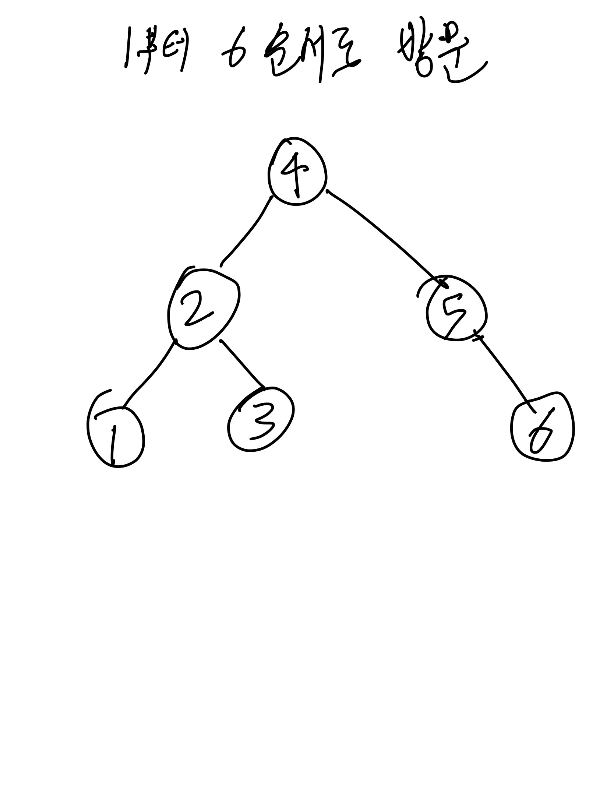

# BFS/DFS 트리 순회

## 용어 정리(그래프 개념)

- 정점(vertex): 위치라는 개념. (node 라고도 부름)
- 간선(edge): 위치 간의 관계. 즉, 노드를 연결하는 선 (link, branch 라고도 부름)
- 인접 정점(adjacent vertex): 간선에 의 해 직접 연결된 정점
- 정점의 차수(degree): 무방향 그래프에서 하나의 정점에 인접한 정점의 수
- 무방향 그래프에 존재하는 정점의 모든 차수의 합 = 그래프의 간선 수의 2배
- 진입 차수(in-degree): 방향 그래프에서 외부에서 오는 간선의 수 (내차수 라고도 부름)
- 진출 차수(out-degree): 방향 그래프에서 외부로 향하는 간선의 수 (외차수 라고도 부름)
- 방향 그래프에 있는 정점의 진입 차수 또는 진출 차수의 합 = 방향 그래프의 간선의 수(내차수 + 외차수)
- 경로 길이(path length): 경로를 구성하는 데 사용된 간선의 수
- 단순 경로(simple path): 경로 중에서 반복되는 정점이 없는 경우
- 사이클(cycle): 단순 경로의 시작 정점과 종료 정점이 동일한 경우

**참고자료**

[[자료구조] 그래프(Graph)란 - Heee's Development Blog](https://gmlwjd9405.github.io/2018/08/13/data-structure-graph.html)

## 1. 이진 트리 넓이우선탐색(BFS)

“몇번만에 갈 수 있는지”(레벨 탐색) 와 출발지 → 도착지 의 “최단거리”를 찾는 방법론이다.

### 1.1 기본 로직

- 이진 트리 BFS 구현 : 자료구조 큐 사용. (FIFO)
  1. 큐 변수 = [ ], 방문한 노드의 value를 저장하는 변수 = [ ] (정답에서 요구하는 자료형에 따라 변형 가능) 선언.
  2. 시작하는 노드(root)를 큐에 넣는다.
  3. 큐 안에 값이 있는 한 반복문을 계속 실행하면서
     1. 큐에서 현재 노드를 Dequeue하고 현재 노드의 value를 노드의 value를 저장하는 변수에 추가.
     2. 만약 Dequeue 된 현재 노드가 left 프로퍼티를 가지고 있다면 큐에 추가(enqueue)한다.
     3. 만약 Dequeue 된 현재 노드가 right 프로퍼티를 가지고 있다면 큐에 추가(enqueue)한다.

```jsx
// * 상태 트리 bfs 탐색 예시
// 현재 노드의 값이 1이라면 x2 해서 왼쪽 방향 하위 노드는 2, x2 + 1 해서 오른쪽 방향 하위 노드 3 하는 예제
// 방문한 노드의 값을 저장하는 변수는 answer 이고 예제에선 자료형을 문자열로 함.
// 방문한 노드의 값을 저장하는 변수의 자료형은 주어진 문제에 따라 다르게 하면 된다.

function treeBfs1() {
  let answer = '';
  let queue = [1];
  while (queue.length) {
    let current = queue.shift(); // Dequeue
    answer += current; // 방문한 노드의 값을 저장.
    for (nextNode of [current * 2, current * 2 + 1]) {
      // for of 문으로 push 한 줄로 2개를 push 함.
      if (nextNode > 7) continue;
      queue.push(nextNode); // Enqueue
    }
  }

  return answer;
}

console.log(treeBfs1()); // 1234567
```

방문한 노드를 저장하는 변수, 큐 변수 2가지 변수를 선언.

큐의 초기값으로 root의 값을 넣은 배열로 선언 시 초기화.

큐가 비어있지 않은 동안 while 문으로 dequeue하고 방문한 노드의 값을 저장. 그 이후에 enqueue하는 반복문을 아래에 만듬.

## 2. 이진 트리 깊이우선탐색(DFS)

depth-first-search: 형제 노드로 넘어가기 전에 수직으로 트리 끝까지 탐색한다.

노드를 탐색할 때 왼쪽 전체를 순회하고 나서 오른쪽 전체를 순회하는 것은 같지만 순회 방식이 전위, 후위, 중위 에 따라 노드를 방문하고 값을 저장하는 순서가 달라진다.

**헬퍼함수를 재귀 호출한다.**

### DFS - PreOrder (전위 순회)

root → 왼쪽 자식 노드 → 왼쪽 자식 노드의 왼쪽 자식 노드 → 왼쪽 자식 노드의 오른쪽 자식 노드 → 오른쪽 노드에 왼쪽과 똑같이 탐색.

모든 노드에 대해서 탐색을 진행할 시에 왼쪽 전부를 탐색하고 그 다음 오른쪽을 탐색한다.

- 의사 코드
  1. 정답으로 출력될 “방문한 노드들의 정보”를 담을 변수를 선언. const visited = [ ];
  2. 트리의 루트 값을 넣은 상태로 current 변수 선언 및 소기화. const current = [1];
  3. 인수로 node를 받는 헬퍼 함수를 함수 내부에 정의. 이 함수는 노드의 값을 변수에 넣어 저장하는 역할만 한다.
     1. visited 에 node의 값을 push.
     2. node가 left 프로퍼티를 가지면 헬퍼 함수를 left의 value를 넣어 호출.(재귀)
     3. node가 right 프로퍼티를 가지면 헬퍼 함수를 right의 value를 넣어 호출.(재귀)
  4. 리턴 visited.

```jsx

```

### DFS - PostOrder(후위 순회)

visited에 추가하는 순서가 전위 순회와 다르다. root를 가장 마지막에 방문하게 된다.

root에서 시작(visited 추가 x, 시작만.) → root의 왼쪽 자식 노드의 왼쪽 손자 노드 추가 → 왼쪽 자식 노드의 오른쪽 손자 노드 추가 → 왼쪽 자식 노드 추가 → root의 오른쪽 자식 노드의 손자 노드 추가 → 오른쪽 자식 노드 추가 → root 추가



1부터 6까지 순서로 visited 추가

- 의사 코드 (헬퍼 함수 안에서의 동작의 순서가 전위 순회와 달라짐.)
  1. 정답으로 출력될 “방문한 노드들의 정보”를 담을 변수를 선언. const visited = [ ];
  2. 트리의 루트 값을 넣은 상태로 current 변수 선언 및 소기화. const current = [1];
  3. 인수로 node를 받는 헬퍼 함수를 함수 내부에 정의. 이 함수는 노드의 값을 변수에 넣어 저장하는 역할만 한다.
     1. node가 left 프로퍼티를 가지면 헬퍼 함수를 left의 value를 넣어 호출.(재귀)
     2. node가 right 프로퍼티를 가지면 헬퍼 함수를 right의 value를 넣어 호출.(재귀)
     3. visited에 node의 값 push.
     4. current 변수에 헬퍼 함수 재귀 호출.
  4. 리턴 visited.

### DFS - InOrder(정위 순회)



- 의사 코드
  1. 정답으로 출력될 “방문한 노드들의 정보”를 담을 변수를 선언. const visited = [ ];
  2. 트리의 루트 값을 넣은 상태로 current 변수 선언 및 소기화. const current = [1];
  3. 인수로 node를 받는 헬퍼 함수를 함수 내부에 정의. 이 함수는 노드의 값을 변수에 넣어 저장하는 역할만 한다.
     1. node가 left 프로퍼티를 가지면 헬퍼 함수를 left의 value를 넣어 호출.(재귀)
     2. visited에 node의 값 push.
     3. node가 right 프로퍼티를 가지면 헬퍼 함수를 right의 value를 넣어 호출.(재귀)
  4. current 변수에 헬퍼 함수 재귀 호출.
  5. 리턴 visited.
